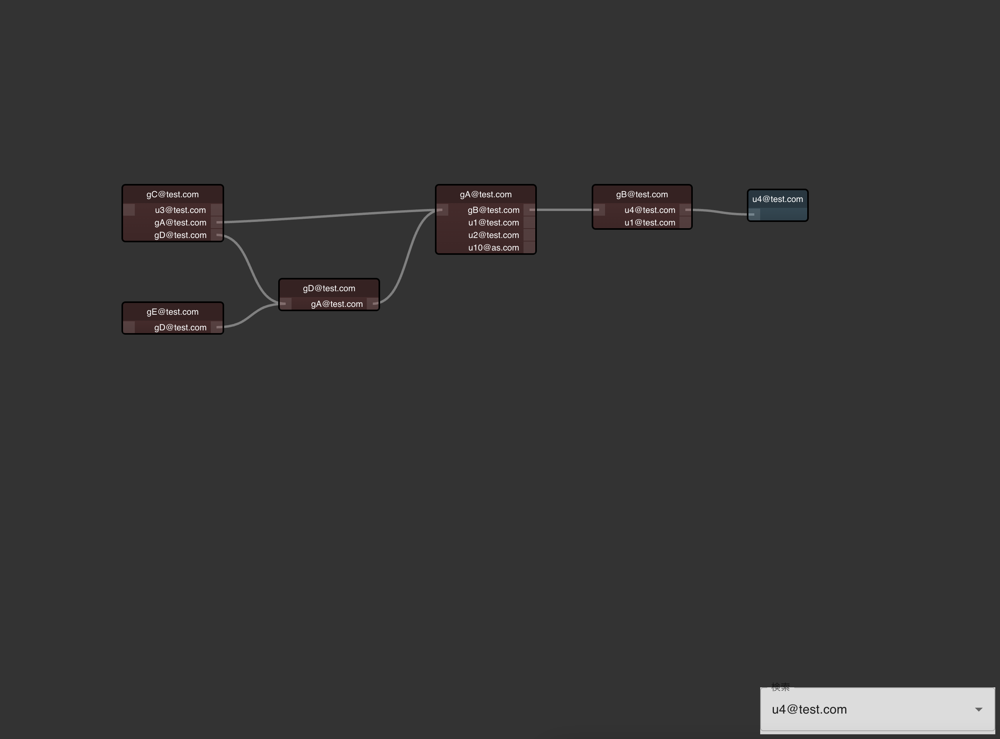

# MailGroup viewer 
メールグループの入れ子構造を可視化するためのツール



## 入力データのサンプル
以下のような形式のCSVを読み込みます。  
https://github.com/MaSuCcHI/mailgroup-viewer/blob/master/app/sample/sample1.csv
```csv:sample
group,user
gA@test.com,gB@test.com
gA@test.com,u1@test.com
gA@test.com,u2@test.com
gB@test.com,u4@test.com
gB@test.com,u1@test.com
gC@test.com,u3@test.com
gC@test.com,gA@test.com
gD@test.com,gA@test.com
gE@test.com,gD@test.com
g1@as.com,u10@as.com
g1@as.com,u11@as.com
gA@test.com,u10@as.com
gC@test.com,gD@test.com
```

## 動かし方
```
cd app 
npm install 
npm start 
```

## その他
ところどころバグってます。そこまでモチベーション高くないので、気が向いたら直します。